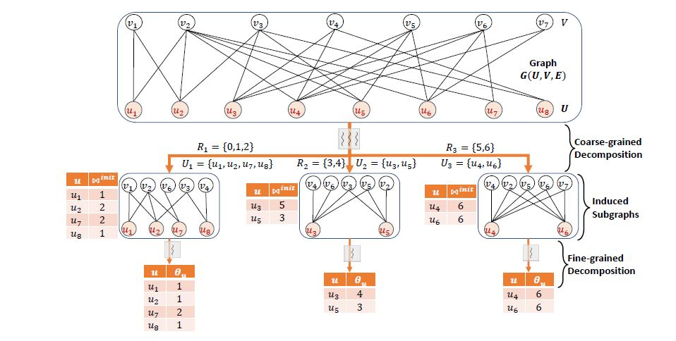

# Parallel Bipartite Network Peeling (PBNG) Framework
Parallel Tip and Wing Decomposition to mine hierarchical dense structures in bipartite graphs

## Introduction
PBNG implements a two-phased peeling for scalable parallel tip and wing decomposition
on shared-memory multi core servers. It partitions the vertices/edges into smaller subsets
and creates independent tasks to process the partitions concurrently. 
It can decompose the largest open bipartite datasets in few minutes, orders of magnitude 
faster than the baselines.

||
|:--:|
|**Graphical Illustration of two-phased peeling in PBNG**|

## Compile
```
make
```

It generates the following executables:

1. **decomposeParWing** - parallel edge peeling (for wing decomposition)
2. **decomposeParTip** - parallel vertex peeling (for tip decomposition)

Baselines:
1. **decomposeSeqWing** - sequential edge peeling (for wing decomposition)
2. **decomposeSeqTip** - sequential vertex peeling (for tip decomposition)
3. **decomposePCWing** - progressive compression approach for wing decomposition

References:
1. [Sequential Tip/Wing Decomposition algorithm](http://sariyuce.com/bnd.tar)
2. [Progressive Compression Wing Decomposition](https://arxiv.org/pdf/2001.06111.pdf)


## Prerequisites
[Boost Sort Parallel Library](https://github.com/fjtapia/sort_parallel)


## Run


### Wing Decomposition
```
./decomposeParWing -i <inputFile> -o <outputFile> -t <# threads> -p <# partitions to create> 

```

### Tip Decomposition
```
./decomposeParTip -i <inputFile> -o <outputFile> -t <# threads> -p <# partitions to create> -s <peelSide>
```

### Arguments

1. **-i** : text file containing input graph in COO format (edge list)
2. **-o** : output file where tip/wing numbers will be written (optional)
3. **-t** : numeric value specifying number of threads to use for decomposition (optional, default = 1)
4. **-p** : numeric value specifying number of partitions to create (optional, recommended for tip decomposition = 150, for wing decomposition = 400)
5. **-s** : enum. Use "**-s 0**" to peel vertex set **U** (LHS in input file) and "-s 1" to peel set "V" (RHS in input file) (optional, default = 0)


Options **-t** and **-p** are not required for sequential decomposition baselines.


## Input
The input file should represent graph in an edge list format where each line is a tuple of two integers as shown below:
```
u v
```
This indicates that there is an edge between vertices `u` and `v`.<br /><br />


The vertices in left column constitute the **U** set and those in right column constitute set **V**.

An example input file is given in the *datasets* directory.<br />
PBNG has been tested extensively on large bipartite graphs from [KOBLENZ collection](http://konect.cc/)
and [Network Data Repository](http://networkrepository.com/).


## Output

### Wing Decomposition
The output is written in the specified file in a text format.<br />
Every line in the output file is a tuple of three integers as shown below: 
```
u v t
```
where `u` and `v` are the vertices of an edge and `t` is it's wing number


### Tip Decomposition
The output is written in the specified file in a text format.<br />
Every line in the output file is a tuple of two integers as shown below: 
```
u t
```
where `u` is the vertex id and `t` is it's tip number


## Paper
Please refer to the paper [RECEIPT: REfine CoarsE-grained IndePendent Tasks for Parallel Tip decomposition of Bipartite Graphs](https://dl.acm.org/doi/abs/10.5555/3430915.3442438)
for details, and cite if you use the code.
